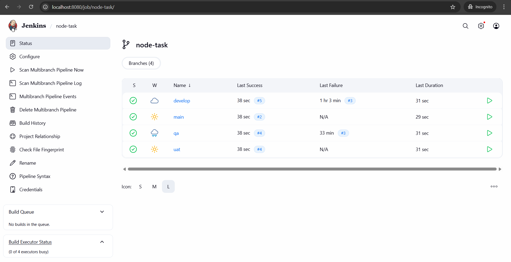
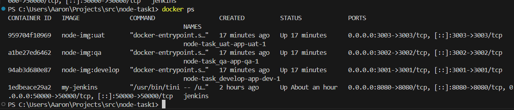
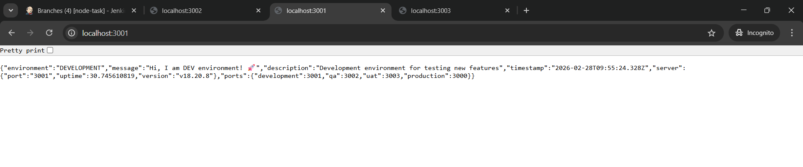
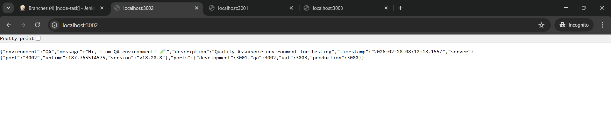
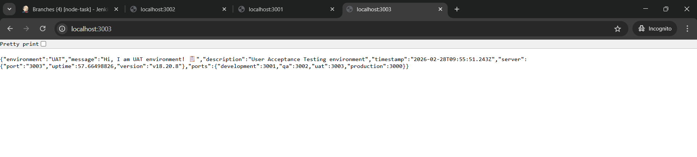

# 🚀 Node.js CI/CD Pipeline with Jenkins & Docker

A complete CI/CD implementation demonstrating automated **build → test → deploy** using:

- Jenkins (CI/CD automation)
- Docker & Docker Compose (containerized environments)
- Git branch–based deployments
- Multiple local environments (Dev / QA / UAT)

Each branch automatically deploys to its respective environment.

---

# 📌 Architecture Overview

Git Repository → Jenkins (Multibranch Pipeline) → Docker Deployments

Branches:
- develop → DEV (localhost:3001)
- qa → QA (localhost:3002)
- uat → UAT (localhost:3003)

Flow:
Code push → Jenkins → Build → Test → Docker Image → Deploy

---

# 🌿 Branching Strategy

| Branch | Environment | Port |
|-------|-------------|------|
| develop | Development | 3001 |
| qa | QA | 3002 |
| uat | UAT | 3003 |

Deployment flow:
develop → qa → uat

- develop → developer testing
- qa → quality assurance
- uat → user acceptance testing

Each push automatically triggers deployment.

---

# ⚙️ CI/CD Pipeline Flow

For every branch push:

1. Checkout latest code
2. Install dependencies (npm install)
3. Run tests (npm test)
4. Build Docker image
5. Deploy with docker-compose to the correct environment

---

# 🐳 Environments

| Environment | URL |
|-------------|--------------------|
| Dev | http://localhost:3001 |
| QA | http://localhost:3002 |
| UAT | http://localhost:3003 |

---

# 📂 Project Structure

node-cicd-project/
├── app.js
├── app.test.js
├── package.json
├── Dockerfile
├── Dockerfile.jenkins
├── Jenkinsfile
├── docker-compose.dev.yaml
├── docker-compose.qa.yaml
├── docker-compose.uat.yaml
├── README.md
└── screenshots/

---

# 🛠 Setup Instructions

## Prerequisites
- Docker Desktop
- Git

## Build Jenkins Image
docker build -f Dockerfile.jenkins -t my-jenkins .

## Run Jenkins
docker run -d --name jenkins -p 8080:8080 -p 50000:50000 -v jenkins_home:/var/jenkins_home -v /var/run/docker.sock:/var/run/docker.sock -v $(pwd):/home/node-cicd-project my-jenkins

Open:
http://localhost:8080

---

# 🚀 Triggering Builds

git checkout develop
git commit --allow-empty -m "trigger dev"
git push

git checkout qa
git commit --allow-empty -m "trigger qa"
git push

git checkout uat
git commit --allow-empty -m "trigger uat"
git push

---

# 🔍 Verifying Deployments

curl http://localhost:3001
curl http://localhost:3002
curl http://localhost:3003

---

# 🔌 API Endpoints

| Endpoint | Purpose |
|-----------|-----------|
| / | Environment info |
| /health | Health check |
| /config | Debug config (dev only) |

---

# 📸 Screenshots

Create a folder named **screenshots/** and add:

- jenkins-success.png
- docker-ps.png
- dev-running.png
- qa-running.png
- uat-running.png

Then reference them:

---

# ⭐ Key Features

- Automated CI/CD with Jenkins
- Branch-based deployments
- Separate Dev / QA / UAT environments
- Dockerized services
- Test automation
- Fully local reproducible setup

---

# ✅ Result

✔ Automated build & test
✔ Environment-based deployment
✔ Docker isolation
✔ Multibranch CI/CD
✔ Ready for interview/demo submission
